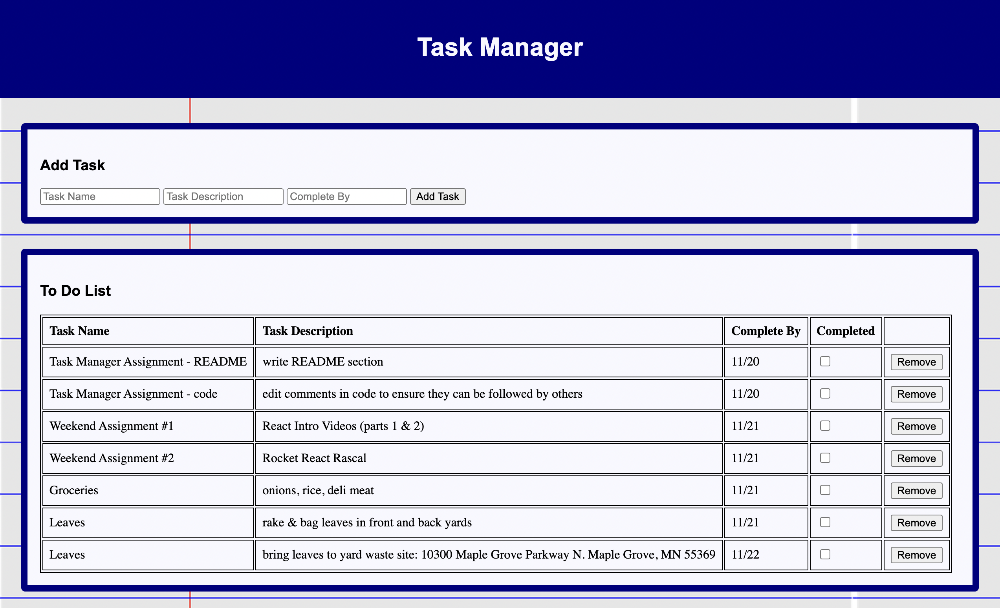

# Task Manager

## Description
---

*Duration: 2 day sprint*

I created an application that allows a user to add tasks to a list. Once added, the user can mark and unmark a task as complete. The user also has the option to remove a task completely from the list. 

To accomplish this, I first created an html layout with sections for adding a new task and displaying existing tasks. Next, I utilized CRUD (Create, Read, Update and Delete) to wire routes for sending information to and from the client, server and database. Lastly, I used CSS styling to move the aesthetics of the page beyond the intrinsic HTML look.

## Screen Shots
---

#### Image 1

#### Image 2

## Prerequisites
---

- [Node.js](https://nodejs.org/en/)
- [PostgreSQL](https://www.postgresql.org/download/)
- [Postico](https://eggerapps.at/postico/)

## Installation
---

1. Create a database named `weekend-to-do-app`.

2. The query in the `database.sql` file is set up to create the necessary table to allow the application to run correctly. The project is built on [PostgreSQL](https://www.postgresql.org/download/), so you will need to have that installed. I recommend using [Postico](https://eggerapps.at/postico/) to run the query, as that was used to create it.

3. Open your editor of choice and run an `npm install` in your terminal to install the project's node dependencies.

4. Run `npm start` in your terminal to start the server. Go to localhost:5000 in your browser to view it.

## Usage
---

1. To add a task, type the information into the input fields of the 'Add Task' section. Next, click the 'Add Task' button. The task will then be added to the list.

3. To mark a task complete, click the task's checkbox in the 'Completed' column. This will gray out the task (see Screen Shots, Image 2). To undo this, simply uncheck the checkbox.

4. To remove a task completely from the list, click the task's 'Remove' button.

## Built With
---

- HTML
- CSS
- JavaScript
- jQuery
- Node.js
- Express.js
- PostgreSQL
- Postico

## Acknowledgment
---

Thank you to Prime Digital Academy, my instructor Matthew Black, and my classmates who equipped and helped me to create this application.

## Support
---

If you have suggestions or issues, please email me at kbrown55347@gmail.com.
